# CANTUM — Project & Product Blueprint

| Campo | Valor |
|---|---|
| Documento | CANTUM — Project & Product Blueprint |
| Versão | 1.2 — Approved Product Baseline |
| Data | 2026-09-09 (v1.1) · 2026-10-08 (v1.2) |
| Status | **Accepted / Product Baseline** |
| Produto | CANTUM |
| Repositório | <https://github.com/Jota0404/cantun> |

> **Nota de conversão (2026-10-01).** Transcrição fiel do PDF *CANTUN_PROJECT_BLUEPRINT_v1.1_APPROVED*. Única alteração de conteúdo: o nome do produto passa de "CANTUN" para **CANTUM**, por decisão do owner (ver ADR-011). As interfaces conceituais em `docs/assets/blueprint/` mantêm a marca antiga nas imagens.

> **v1.2 (2026-10-08).** Incorpora as decisões de produto da auditoria de viabilidade de 2026-10-01 (registradas em `docs/DELIVERY_PLAN.md` §2) e a troca de infraestrutura remota:
> - §5.1 e §49: papéis em dois níveis (organização e equipe); matriz detalhada em `docs/PERMISSIONS.md` (ADR-051).
> - §8.3 e §53: `needed` passa a ser estado da **vaga**, não da atribuição.
> - §16.2, §30.3, §47.2 e §59.1: infraestrutura remota passa a ser PostgreSQL com backend próprio (ADR-049, ADR-059), no lugar do Supabase.
>
> Nenhuma outra seção mudou.

**Organize • Prepare • Escala • Executa • Conecta**

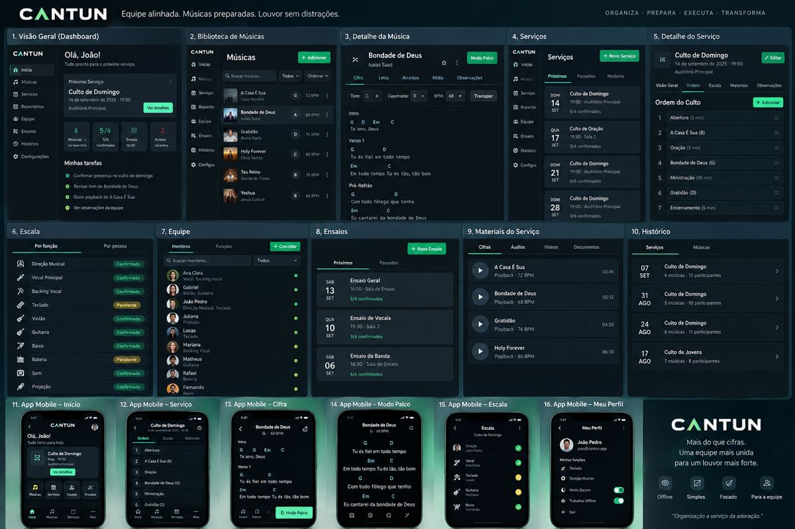

> Interfaces conceituais. Referências visuais para discussão de produto e UX. Não representam a implementação final das telas.

## 0. Propósito deste documento

Este documento define a visão de produto, fronteira, princípios, capacidades, jornadas, requisitos de alto nível e direcionadores de arquitetura do CANTUM em sua nova fase.

O CANTUM nasceu como uma aplicação local-first para músicos de igreja armazenarem cifras personalizadas, organizarem repertórios e executarem músicas no modo palco. A evolução agora transforma o produto em uma plataforma de administração e operação de equipes de louvor, preservando o núcleo musical e de execução e acrescentando uma camada de gestão de equipe e serviços.

O documento foi construído a partir de:

- documentação e código já existentes no repositório CANTUM;
- estado de desenvolvimento observado nas branches atuais do repositório;
- decisões tomadas durante a definição do novo produto;
- análise comparativa de Worship OS, Planning Center, WorshipTools, WorshipTeam e produtos de conexão entre igrejas e músicos;
- referências de UX, acessibilidade, segurança e proteção de dados.

Este documento é produto-first. Ele descreve o que o CANTUM deve ser, por que deve existir e quais capacidades precisa oferecer. Detalhes de implementação permanecem sujeitos aos documentos de arquitetura e ADRs.

### Regra de autoridade

As fontes de verdade são separadas por tipo de decisão:

```text
Produto / escopo / comportamento
          -> CANTUM Project & Product Blueprint

Arquitetura / tecnologia / infraestrutura
          -> CANTUM Architecture

Decisões arquiteturais relevantes
          -> ADRs com status Accepted

Execução / implementação
          -> Feature Specs + GitHub Issues / PRs

Código atual
          -> evidência da implementação, nunca limite da visão aprovada

Suposições da IA
          -> sem autoridade
```

Uma implementação existente não deve limitar uma decisão de produto aprovada. Da mesma forma, uma mudança arquitetural importante não deve ser escondida dentro de uma implementação sem atualizar sua decisão correspondente.

## 1. Visão do produto

### 1.1 Definição

> O CANTUM é uma plataforma para equipes de louvor que permite organizar a equipe, montar e administrar escalas e serviços, preparar repertórios e ensaios e facilitar a execução das músicas durante o culto.

Existe ainda uma segunda capacidade estratégica:

> A igreja administra sua própria equipe no CANTUM e, quando faltar alguém para uma necessidade específica de um serviço ou evento, o CANTUM permite encontrar essa pessoa fora da equipe e conectar as duas partes.

O CANTUM, portanto, deve funcionar como o centro operacional da equipe de louvor - do planejamento de um serviço até sua execução e registro posterior.

### 1.2 Fluxo central

```text
ORGANIZAR
     ↓
PLANEJAR
     ↓
ESCALAR
     ↓
PREPARAR
     ↓
ENSAIAR / REVISAR
     ↓
EXECUTAR
     ↓
REGISTRAR
```

A escrita acima representa uma cadeia conceitual. O produto não precisa exibir essas palavras literalmente em toda interface; elas representam o fluxo de valor que o sistema deve apoiar.

### 1.3 Frase de posicionamento

Mais do que cifras: uma plataforma para organizar, preparar e operar uma equipe de louvor.

### 1.4 Promessa do produto

O CANTUM deve reduzir o trabalho administrativo e a desorganização da equipe sem transformar a ferramenta em um sistema genérico de gestão de igreja ou em uma rede social.

## 2. O problema

Equipes de louvor frequentemente precisam coordenar, com ferramentas desconectadas, pessoas, funções, serviços, repertórios, cifras, tons, ensaios e informações de última hora.

O problema principal não é a ausência de uma ferramenta isolada. É a fragmentação do processo.

Exemplo recorrente:

```text
Líder
   ↓
Planilha para escala
   ↓
WhatsApp para confirmação
   ↓
Google Drive para material
   ↓
PDF/print para cifra
   ↓
Memória para lembrar o arranjo
   ↓
Celular do músico durante o culto
```

O custo aparece em várias dimensões:

- tempo administrativo;
- retrabalho;
- dúvidas repetidas;
- mudanças que não chegam a todos;
- repertórios e materiais desatualizados;
- maior chance de erro no serviço;
- dependência de pessoas específicas para manter o processo funcionando.

### 2.1 Problema administrativo

O líder precisa gastar energia para descobrir:

- quem está escalado;
- quem confirmou;
- qual função está sem pessoa;
- quem está indisponível;
- quem pode substituir alguém;
- qual é a informação atual do serviço.

### 2.2 Problema musical

A equipe precisa saber:

- qual música será tocada;
- em qual tom;
- qual versão/arranjo;
- qual BPM, quando aplicável;
- quais observações existem;
- onde estão os materiais de preparação.

### 2.3 Problema de preparação

O músico precisa receber informação suficiente para se preparar sem depender de uma sequência de mensagens e arquivos.

### 2.4 Problema de execução

Durante o culto, o sistema precisa desaparecer o máximo possível da atenção do músico. O conteúdo musical deve estar disponível de maneira clara, rápida e confiável.

### 2.5 Problema de capacidade da equipe

Às vezes a equipe não possui determinada habilidade necessária para um serviço. O problema passa a ser:

> "Precisamos de uma pessoa para uma necessidade concreta deste serviço e não temos essa função dentro da equipe."

Essa é a origem da futura Network do CANTUM.

## 3. O que o CANTUM é - e o que não é

### 3.1 É

- software de operação de equipes de louvor;
- ferramenta de planejamento de serviços;
- ferramenta de gestão de escalas;
- biblioteca musical da equipe;
- ferramenta de preparação de repertórios e ensaios;
- ambiente de execução musical;
- futura camada de descoberta/conexão entre igrejas e músicos para necessidades pontuais.

### 3.2 Não é

- sistema geral de gestão da igreja;
- ERP;
- CRM;
- sistema financeiro;
- plataforma de doações;
- rede social genérica;
- mensageiro geral;
- plataforma de discipulado;
- ferramenta de onboarding de voluntários;
- calendário pessoal genérico;
- marketplace de pagamento;
- sistema de contratação formal;
- sistema de folha, faturamento ou emissão de documentos para músicos.

## 4. Público-alvo

### 4.1 Público primário

Equipes de louvor de igrejas, especialmente pequenas e médias, nas quais o líder ou coordenador acumula uma parcela relevante do trabalho administrativo.

A prioridade de design deve considerar equipes em que simplicidade e baixo atrito são importantes.

### 4.2 Usuários principais

**Líder de louvor**  
Responsável por organizar a equipe, planejar serviços, montar repertórios, administrar escalas e acompanhar a preparação.

**Membro da equipe**  
Músico, cantor ou operador que precisa saber o que fará, preparar suas partes e executar durante o serviço.

**Administrador**  
Pessoa responsável por configuração da organização/equipe, permissões, membros e regras gerais.

**Owner**  
Responsável pela organização no nível superior da conta e pela administração máxima da estrutura.

### 4.3 Usuários futuros da Network

**Igreja/organização buscando ajuda pontual**  
Precisa encontrar uma pessoa com uma determinada habilidade para um serviço/evento específico.

**Músico disponível**  
Possui determinadas funções/competências e deseja ser encontrado para necessidades pontuais.

**Princípio**

A Network conecta necessidades concretas de serviços. Ela não deve ser posicionada, neste projeto, como plataforma de recrutamento permanente de membros para igrejas.

## 5. Papéis e funções

Uma regra fundamental do domínio é:

> papel de acesso e função musical/técnica são conceitos diferentes.

### 5.1 Papéis de acesso

| Papel | Responsabilidade principal |
|---|---|
| Owner | controle máximo da organização/conta |
| Administrador | administração operacional |
| Líder | coordenação da equipe, serviços e escalas |
| Membro | participação e execução |

**v1.2 — dois níveis.** Na organização, os papéis são Owner, Administrador e Membro. Na equipe, Líder e Membro: uma pessoa pode liderar uma equipe e ser membro de outra. O Líder exerce seus poderes só na equipe que lidera. Matriz detalhada: `docs/PERMISSIONS.md` (ADR-051).

### 5.2 Funções

As funções representam aquilo que a pessoa faz na operação musical/técnica.

Exemplos:

- Direção musical
- Vocal principal
- Backing vocal
- Teclado
- Piano
- Violão
- Guitarra
- Baixo
- Bateria
- Percussão
- Violino
- Saxofone
- Som
- Projeção
- Iluminação

Uma pessoa pode possuir múltiplas funções.

Exemplo:

```text
João
Papel: Membro
Funções: Teclado + Direção Musical
```

## 6. Modelo organizacional

A estrutura conceitual do produto será:

```text
Conta / Usuário
          ↓
Organização / Igreja
          ↓
Equipe
          ↓
Pessoas
          ↓
Funções
```

### 6.1 Cardinalidade aprovada

Para a primeira implementação do novo core:

- uma conta possui uma organização principal;
- uma organização pode possuir uma ou mais equipes desde o ponto de vista do modelo;
- uma pessoa pode participar de uma ou mais equipes dentro da mesma organização, quando aplicável;
- suporte a múltiplas organizações por uma mesma conta fica fora do primeiro escopo e poderá ser adicionado futuramente.

O modelo de dados não deve usar uma restrição que impeça a relação 1:N entre Organization e Team. Isso evita migração estrutural quando a segunda equipe surgir.

### 6.2 Onboarding inicial

O fluxo mínimo de primeira utilização deve ser:

```text
Criar conta
    ↓
Criar organização
    ↓
Usuário torna-se Owner
    ↓
Criar equipe principal
    ↓
Convidar membros
    ↓
Definir funções e permissões iniciais
```

A mecânica exata de convite (link, código, e-mail ou combinação) será definida na especificação da feature de onboarding, mas o comportamento conceitual deve ser preservado.

### 6.3 Motivo

Esse modelo separa identidade, organização e equipe sem impedir expansão futura.

## 7. Core do CANTUM

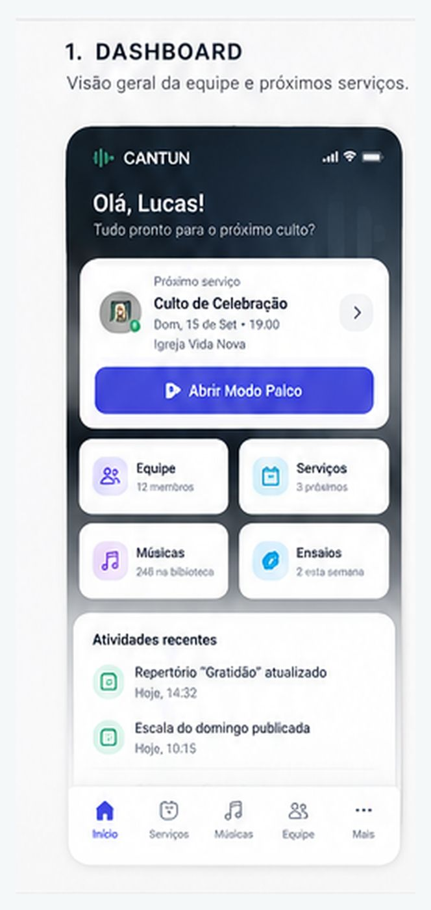

*Interface conceitual — visão geral da equipe e dos próximos serviços.*

O núcleo do produto é:

```text
EQUIPE
PESSOAS / FUNÇÕES
SERVIÇOS
ESCALAS
MÚSICAS
REPERTÓRIOS
ENSAIOS
MODO PALCO
```

O valor do produto está na integração entre esses módulos.

Uma lista de features não deve romper esse fluxo.

## 8. Capacidades do sistema

### 8.1 Equipe

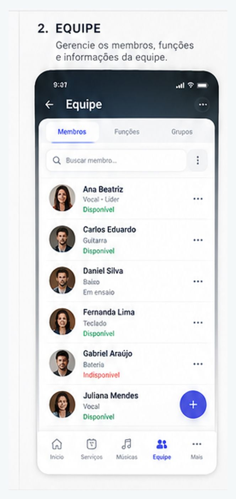

*Interface conceitual — membros, funções, disponibilidade e estados.*

A equipe deve permitir:

- cadastrar pessoas;
- convidar membros;
- definir papel de acesso;
- definir funções;
- visualizar composição atual;
- registrar informações operacionais necessárias;
- controlar disponibilidade;
- visualizar participação em serviços;
- identificar lacunas de função.

### 8.2 Serviços

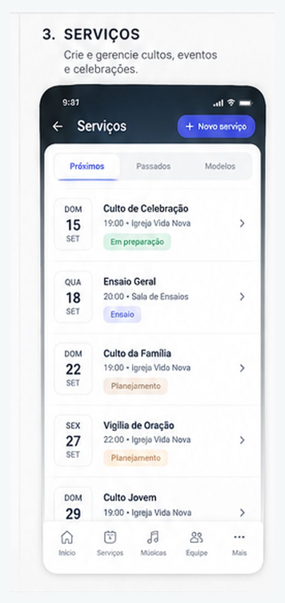

*Interface conceitual — serviços futuros, passados e em planejamento.*

Service é a unidade que representa a ocasião real em que a equipe atuará.

Exemplos:

- culto de domingo;
- culto de oração;
- culto especial;
- evento da igreja;
- conferência;
- noite de louvor.

Um serviço pode conter:

```text
Service
├── informações básicas
├── ordem do serviço
├── equipe
├── escala
├── repertório
├── materiais
├── ensaio
├── observações
└── histórico após execução
```

A interface deve priorizar o que a equipe precisa para aquele serviço. Não devemos criar um "calendário" como produto separado só porque o serviço possui data e horário.

### 8.3 Escalas

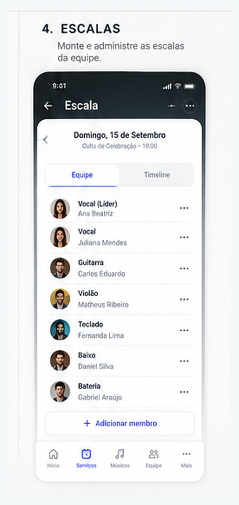

*Interface conceitual — funções, pessoas, confirmações e edição.*

Escala é a associação entre serviço + função + pessoa.

Fluxo básico:

```text
Service
   ↓
Funções necessárias
   ↓
Pessoas atribuídas
   ↓
Confirmação
```

Estados recomendados para uma atribuição:

```text
needed
invited
confirmed
declined
replacement_needed
cancelled
```

Os nomes podem mudar na implementação, mas o comportamento precisa existir.

**v1.2 — vaga × atribuição.** A função necessária no serviço é uma **vaga** (função + quantidade), que fica aberta ou preenchida conforme as atribuições; `needed` descreve a vaga aberta. A **atribuição** liga uma pessoa à vaga e usa `invited`, `confirmed`, `declined`, `replacement_needed` e `cancelled`.

**Operações essenciais**

- adicionar pessoa a uma função;
- remover pessoa;
- enviar solicitação/convite;
- aceitar;
- recusar;
- indicar necessidade de substituição;
- visualizar posições preenchidas e vazias.

**Automação futura**

O CANTUM poderá sugerir ou preencher escala com base em disponibilidade, histórico, função e regras definidas pela equipe.

A referência de mercado mostra que automações de escala podem considerar histórico, preferências e datas bloqueadas, e algumas plataformas já automatizam nova tentativa de preenchimento quando alguém recusa uma solicitação. Planning Center e Planning Center - auto-reschedule são referências para o problema, não modelos de implementação obrigatória.

### 8.4 Disponibilidade

Cada membro poderá informar sua disponibilidade para servir.

Conceitos esperados:

- disponível;
- indisponível;
- disponibilidade parcial/sujeita a confirmação;
- datas bloqueadas;
- preferências futuras.

A disponibilidade existe para apoiar a escala. Ela não deve virar um calendário pessoal genérico.

### 8.5 Repertórios

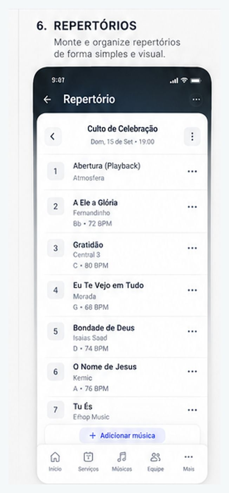

*Interface conceitual — sequência de músicas e vínculo com o serviço.*

Repertoire / Setlist representa uma seleção ordenada de músicas.

Ele é diferente de Service.

```text
Song
    ↓
Repertoire / Setlist
    ↓
Service
```

Uma música pode pertencer a vários repertórios.

Um repertório pode ser reutilizado em diferentes serviços, evitando retrabalho.

Operações essenciais:

- criar;
- renomear;
- excluir;
- duplicar;
- adicionar música;
- remover música;
- reordenar;
- visualizar músicas;
- preparar para um serviço.

### 8.6 Ordem do serviço

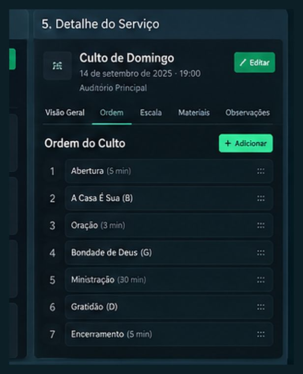

*Interface conceitual — ordem do culto e organização operacional.*

O serviço pode possuir uma sequência mais ampla que apenas músicas.

Exemplo:

```text
1. Abertura
2. Música
3. Oração
4. Música
5. Ministração
6. Música
7. Encerramento
```

O conceito de ServiceItem permite que música seja apenas um tipo de item entre outros.

O Planning Center e o WorshipTools usam uma estrutura semelhante de ordem de serviço; WorshipTools organiza um serviço com abas/áreas de Order, People, Rehearse e Charts. Planning Center e WorshipTools.

### 8.7 Música

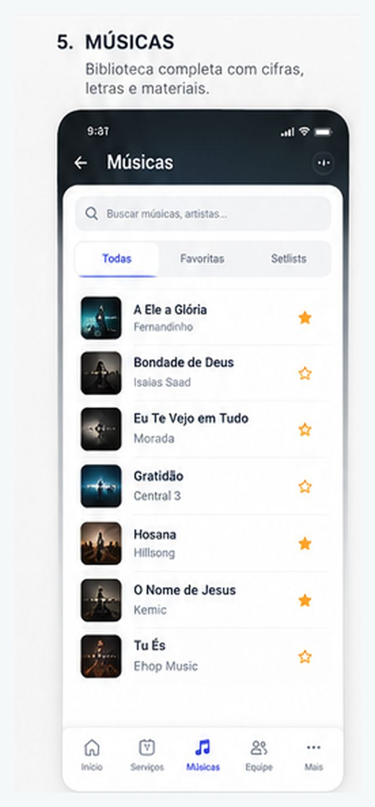

*Interface conceitual — pesquisa, favoritos, tons e acesso rápido à cifra.*

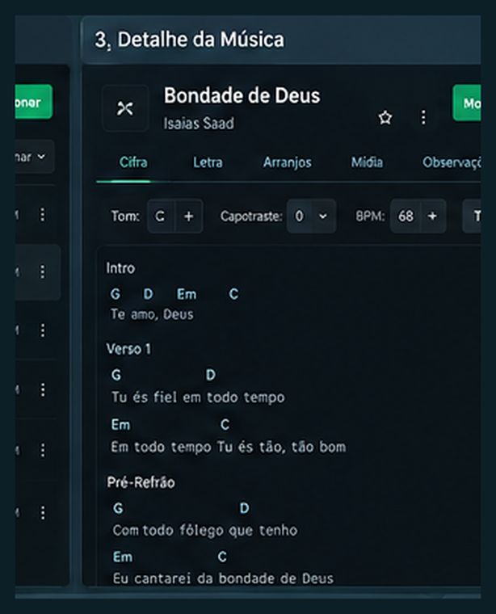

*Interface conceitual — cifra, tom, BPM e transposição.*

A biblioteca musical continua sendo um dos pilares do CANTUM.

Uma música deve conservar, no mínimo, o conceito já existente:

```text
Song
├── title
├── artist
├── originalKey
├── currentKey
├── bpm
├── lyrics / chart
├── notes
├── favorite
└── timestamps
```

O domínio poderá evoluir para suportar múltiplas versões/arranjos sem destruir a simplicidade do armazenamento atual.

**Arranjos**

Uma mesma música pode ter, conceitualmente, diferentes arranjos ou versões:

```text
Song
  ├── Arrangement A
  │     └── key / chart / materials
  ├── Arrangement B
  │     └── key / chart / materials
  └── Arrangement C
        └── key / chart / materials
```

Decisão v1.1: Arrangement é um conceito de domínio previsto, mas não é uma entidade persistida independente no primeiro escopo do novo core. O CANTUM deve preservar espaço para essa evolução sem criar CRUD, tabela ou repository dedicado antes de existir necessidade real.

Quando a necessidade aparecer, a promoção para entidade persistida deverá ser registrada em decisão arquitetural/ADR e refletida no modelo de dados.

**Transposição**

A transposição continua sendo lógica de domínio independente da UI.

A cifra base deve permanecer estável sempre que possível, e a versão apresentada pode ser derivada.

### 8.8 Ensaios


*Interface conceitual — progresso, músicas, materiais e anotações.*

O CANTUM deve permitir que o serviço concentre os materiais e informações necessários para preparação.

Exemplo:

```text
Ensaio
├── horário
├── serviço relacionado
├── músicas
├── cifras
├── áudios
├── vídeos
├── documentos
└── observações
```

O objetivo não é criar uma plataforma educacional completa. É facilitar a preparação do serviço.

WorshipTools e Planning Center são referências relevantes porque vinculam materiais, músicas, pessoas e preparação diretamente ao serviço. WorshipTools e Planning Center.

### 8.9 Modo Palco

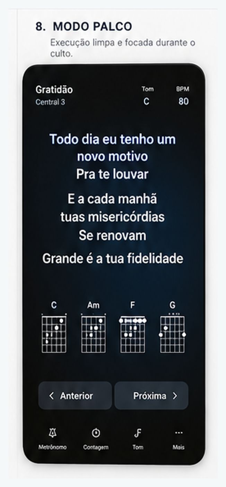

*Interface conceitual — execução, leitura e navegação sem distração.*

O Modo Palco permanece como experiência crítica do CANTUM.

Prioridades:

- leitura clara;
- poucos controles;
- grande área de conteúdo;
- navegação anterior/próxima;
- transposição rápida;
- controle de tamanho de fonte;
- auto-scroll;
- tela cheia quando suportado;
- alto contraste;
- estado de execução compartilhado quando aplicável;
- funcionamento confiável mesmo com conexão instável.

A referência visual apresenta também experiência mobile dedicada ao palco.

**Princípio**

> O músico deve conseguir usar o CANTUM durante a execução sem sentir que está "administrando um software".

## 9. Histórico

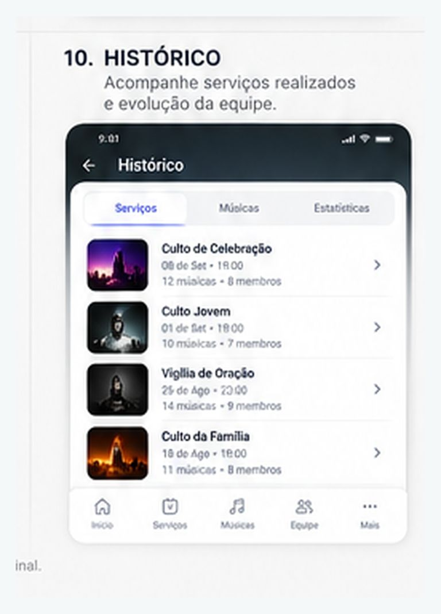

*Interface conceitual — serviços realizados e histórico da equipe.*

O histórico deve registrar eventos relevantes do produto sem virar um sistema de auditoria excessivamente complexo.

Possíveis registros:

```text
Service
├── data
├── repertório
├── equipe
└── execução

Song
├── últimas utilizações
├── frequência
├── tons usados
└── repertórios relacionados
```

O histórico pode apoiar decisões de liderança, preparação de repertório e futuras automações.

Não será requisito inicial implementar analytics sofisticado.

## 10. Network - descoberta de músicos

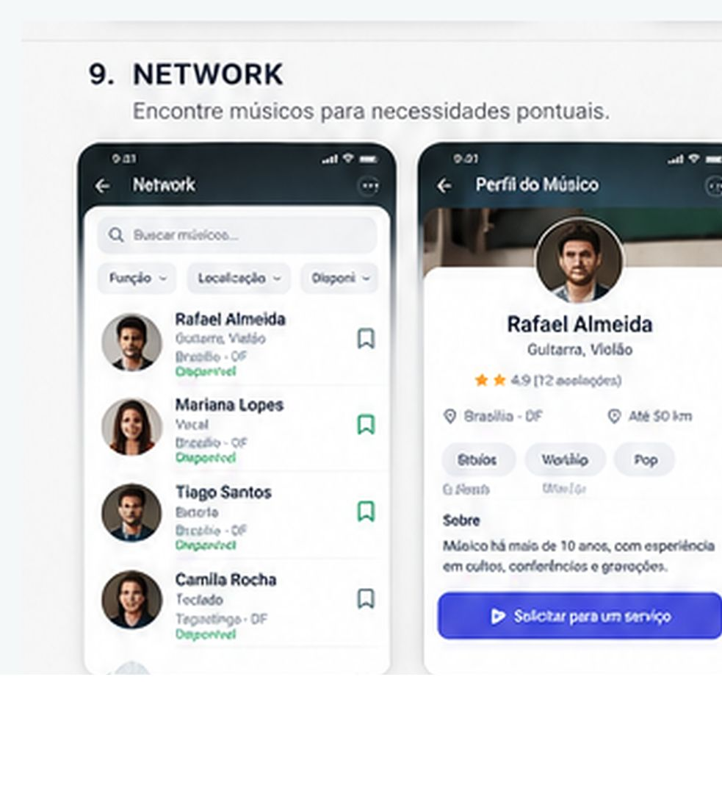

*Interface conceitual — busca de músicos e perfil público para necessidades pontuais; sem chat persistente.*

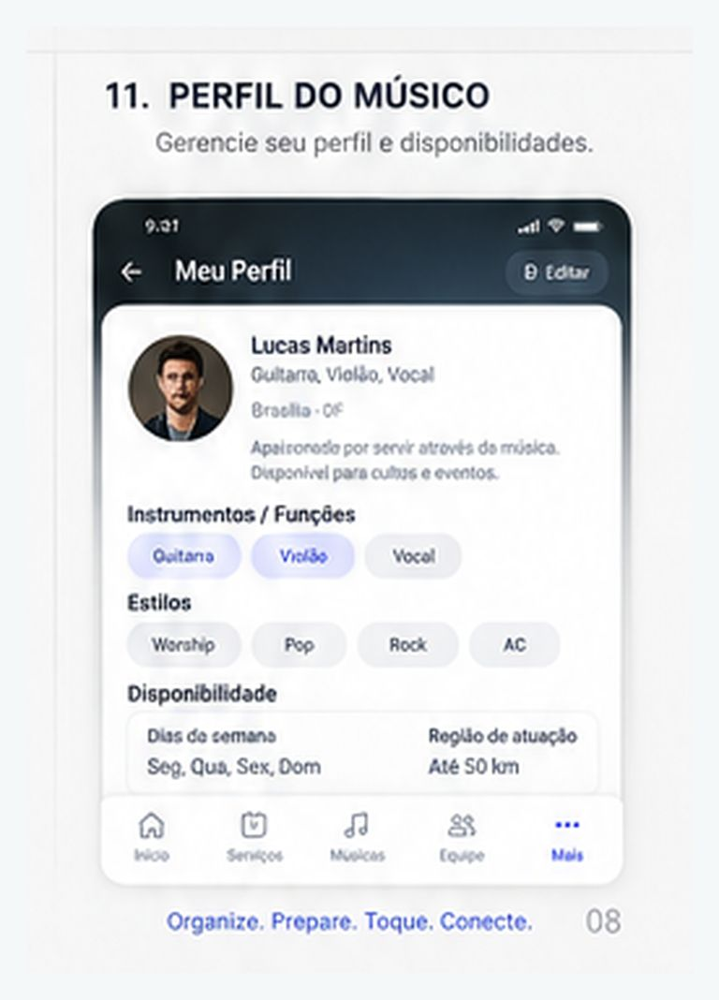

*Interface conceitual — competências, localização aproximada, disponibilidade e convite para um serviço específico.*

### 10.1 Objetivo

Quando uma equipe não possui uma função necessária para um serviço ou evento, o CANTUM deve permitir descobrir pessoas externas à equipe.

Exemplo:

```text
Culto especial
     ↓
Necessidade: 1 violinista
     ↓
Buscar no CANTUM
     ↓
Violino + Brasília + disponível
     ↓
Visualizar perfil
     ↓
Enviar solicitação para este serviço
     ↓
Aceite / recusa
     ↓
Contato entre as partes
```

### 10.2 A Network não é recrutamento

Não é objetivo inicial:

- contratar alguém permanentemente para a equipe;
- criar vagas de emprego de longo prazo;
- gerenciar carreira profissional;
- criar contratos;
- cobrar comissão.

A Network existe para necessidades pontuais e concretas de serviços.

### 10.3 A Network não é chat

Não haverá uma caixa de mensagens privadas como eixo do produto.

O relacionamento deve ser orientado a uma necessidade:

```text
Need / Service Request
          ↓
Profile
          ↓
Invite / Request
          ↓
Accept / Decline
          ↓
External Contact
```

Uma solicitação pode conter uma única mensagem contextual, vinculada ao serviço/necessidade. Essa mensagem não inicia uma conversa persistente: não existe thread, inbox, histórico de chat, resposta dentro do CANTUM ou mecanismo de mensagens privadas.

Após o aceite, os detalhes da relação são tratados fora da plataforma, conforme as regras da Network.

### 10.4 Busca

Filtros iniciais:

- função/instrumento;
- localização;
- disponibilidade;
- tipo de atuação.

Exemplo:

```text
Violino → Brasília → 20/09 → culto/evento
```

### 10.5 Perfil público

O perfil público deve mostrar apenas informações necessárias para descoberta e conexão.

Possíveis campos:

- nome público;
- foto;
- funções;
- experiência resumida;
- localização aproximada;
- disponibilidade para convites;
- descrição curta;
- links ou mídia, se futuramente aprovados.

Dados operacionais da equipe não devem ser públicos por padrão.

A imagem representa uma hipótese de UX, não uma tela final.

### 10.6 Modelo de oportunidade

O conceito recomendado para o domínio é uma necessidade de serviço, não uma vaga.

```text
Service
    ↓
ServiceNeed
    ├── function
    ├── quantity
    ├── date/time
    ├── location
    ├── context
    └── status
```

Exemplo:

```text
ServiceNeed
Função: Violino
Quantidade: 1
Serviço: Culto Especial
Data: 20/09
Status: Open
```

A igreja pode procurar pessoas que atendam à necessidade ou, futuramente, publicar a necessidade para descoberta.

### 10.7 Papel do CANTUM

O CANTUM é mediador de descoberta e conexão.

O CANTUM não será parte do acordo entre as pessoas.

Não haverá, na fase definida neste documento:

- contrato dentro da plataforma;
- cobrança;
- pagamento;
- comissão sobre serviços;
- faturamento;
- garantia financeira.

Questões jurídicas e de responsabilidade devem ser cobertas nos termos de uso e política de privacidade quando a Network entrar em operação.

## 11. Referências de mercado e o que aprendemos

### 11.1 Worship OS

O Worship OS se apresenta como uma plataforma central para reduzir caos em ministérios de louvor, cobrindo comunicação, planejamento, onboarding, devocionais e IA. Para o CANTUM, ele será usado principalmente como referência de administração de equipe e organização, e não como modelo de escopo completo. Worship OS

**Usaremos como referência**

- organização da equipe;
- visão centralizada do trabalho;
- redução de caos administrativo;
- organização das responsabilidades;
- experiência centrada no líder/equipe.

**Deliberadamente fora**

- Team Feed;
- Private Messages;
- chat;
- Planner/calendar sync;
- Volunteer Onboarding;
- Team Devotionals;
- IA do Worship OS.

### 11.2 Planning Center

Planning Center Services combina planejamento de serviços, voluntários, ordem de serviço, notas, ensaio e biblioteca musical. A documentação atual também apresenta automações de escala, disponibilidade, posições, templates e materiais. Planning Center Services

**Usaremos como referência**

- Service como unidade de planejamento;
- posições/funções;
- escala;
- disponibilidade;
- ordem de serviço;
- biblioteca musical;
- repertórios;
- ensaio;
- histórico e contexto.

**Não copiaremos**

- arquitetura do produto;
- modelo de negócio;
- todos os módulos do ecossistema;
- gestão geral da igreja.

### 11.3 WorshipTools

WorshipTools apresenta um modelo de serviço com Order, People, Rehearse e Charts, além de matriz de escala e materiais de preparação. WorshipTools - Services

**Usaremos como referência**

- Service;
- People;
- Rehearse;
- Charts;
- scheduling matrix;
- materiais vinculados ao serviço.

### 11.4 WorshipTeam

O modelo de WorshipTeam é uma referência útil para pensar em músicas, arranjos, materiais e organização de recursos musicais dentro de um fluxo de equipe.

A principal lição para o CANTUM é que "música" pode precisar comportar versões/arranjos e materiais diferentes sem deixar de representar uma única composição.

### 11.5 Plataformas de conexão entre igrejas e músicos

Produtos como Church Musician Connect, Sayla, ChurchSync e Praizle mostram que existe um espaço de produto para descoberta e conexão entre igrejas e músicos. Church Musician Connect · Sayla · ChurchSync · Praizle

O CANTUM diferencia sua hipótese dessa categoria porque a Network não é o produto principal: ela nasce dentro do fluxo operacional do serviço.

## 12. Jornada principal do usuário

### 12.1 Jornada do líder

```text
Abrir CANTUM
     ↓
Ver o próximo trabalho relevante
     ↓
Criar/abrir Service
     ↓
Definir ordem
     ↓
Montar repertório
     ↓
Definir funções
     ↓
Escalar pessoas
     ↓
Identificar lacunas
     ↓
Buscar pessoa externa, se necessário
     ↓
Organizar materiais
     ↓
Preparar ensaio
     ↓
Executar serviço
     ↓
Registrar histórico
```

### 12.2 Jornada do membro

```text
Receber/abrir serviço
     ↓
Ver função atribuída
     ↓
Confirmar participação
     ↓
Ver músicas e materiais
     ↓
Preparar
     ↓
Ensaiar
     ↓
Abrir Modo Palco
     ↓
Executar
```

### 12.3 Jornada de uma necessidade externa

```text
Serviço
    ↓
Lacuna de função
    ↓
Criar ServiceNeed
    ↓
Buscar músico externo
    ↓
Selecionar perfil
    ↓
Enviar solicitação
    ↓
Aceite / recusa
    ↓
Contato externo
    ↓
Participação no serviço
```

## 13. Service Blueprint conceitual

| Camada | Antes do serviço | Durante | Depois |
|---|---|---|---|
| Equipe | disponibilidade, escala | execução | histórico |
| Líder | planejamento, ordem, materiais | coordenação | revisão |
| Músico | preparação, ensaio | Modo Palco | consulta futura |
| CANTUM | dados do serviço, repertório, escala | navegação/execução | registro |
| Network | busca/conexão, quando necessário | apoio ao serviço | histórico de participação |

O objetivo do produto é que a maior parte do trabalho operacional aconteça no mesmo contexto do serviço, reduzindo a troca de ferramentas.

## 14. Arquitetura conceitual do domínio

O domínio esperado para a evolução do CANTUM é aproximadamente:

```text
Organization
   │
   ├── Team
   │      ├── Member
   │      └── Role / Permission
   │
   ├── Songs
   │      └── Arrangements
   │
   ├── Repertoires
   │
   ├── Services
   │      ├── ServiceItems
   │      ├── Assignments
   │      ├── Rehearsals
   │      └── Materials
   │
   └── History

Network (futuro)
   ├── PublicProfile
   ├── ServiceNeed
   ├── Invitation / Request
   └── ContactExchange
```

### 14.1 Relações essenciais

```text
User
   ↓ belongs to
Organization
   ↓ owns/contains
Team

Team
   ↓ schedules
Service

Service
   ↓ includes
ServiceItem

Service
   ↓ uses
Repertoire

Repertoire
   ↓ contains
Song

Service
   ↓ assigns
Member + Role

Service
   ↓ may create
ServiceNeed

ServiceNeed
   ↓ may connect to
PublicProfile
```

## 15. Privado x público

### 15.1 Privado

- escalas;
- informações internas do serviço;
- observações privadas da equipe;
- dados operacionais;
- repertórios internos;
- disponibilidade individual detalhada;
- informações administrativas.

### 15.2 Público na Network

- nome público;
- foto, se escolhida;
- funções;
- localização aproximada;
- experiência resumida;
- disponibilidade para convites;
- outras informações explicitamente publicadas.

**Princípio**

> Publicar somente o necessário para a finalidade de descoberta.

A ANPD recomenda práticas de minimização de dados e incorporação de privacidade desde as fases iniciais de produtos digitais; isso é particularmente relevante para a Network. ANPD - segurança e proteção de dados · ANPD - Privacy by Design e proteção de dados

Convicção religiosa e filiação a organização religiosa são dados pessoais sensíveis nos termos da LGPD; portanto, informações públicas de perfil devem ser desenhadas com finalidade, minimização e base legal apropriadas. Governo Federal - LGPD

## 16. Offline e online

A decisão atual é híbrida.

### 16.1 Core operacional

Continua local-first:

```text
React
  ↓
Application
  ↓
Repository
  ↓
IndexedDB / Dexie
```

O sistema deve continuar útil sem internet para as funções essenciais já disponíveis localmente.

### 16.2 Infraestrutura remota

A autenticação e a sincronização multidispositivo usam PostgreSQL com backend próprio (ADR-049, ADR-059), no lugar do Supabase adotado inicialmente pelo ADR-012. IndexedDB/Dexie continua como armazenamento local, e as operações sincronizam quando a conexão estiver disponível.

### 16.3 Network

A Network depende de uma camada online porque a busca de músicos externos exige um índice compartilhado.

Assim:

```text
CANTUM CORE
      ↓
local-first

NETWORK
      ↓
cloud-backed
```

Essa separação deve ser preservada para evitar que a necessidade de busca online transforme a execução musical em uma experiência dependente de internet.

### 16.4 Materiais compartilhados

Materiais que precisam ser acessados por diferentes membros/dispositivos não devem depender somente do armazenamento local.

Modelo conceitual:

```text
Metadados do material
          ↓
Dados sincronizados

Arquivo
          ↓
Cloud Storage
          ↕
Cache local quando necessário
```

A infraestrutura exata e os limites operacionais (tipo, tamanho, retenção e cache) serão definidos na arquitetura e na especificação da feature. O requisito de produto é que materiais compartilhados relevantes possam ser disponibilizados à equipe sem depender de um único dispositivo.

O modo offline deve continuar suportando materiais previamente sincronizados/cacheados quando tecnicamente viável.

## 17. Acessibilidade e UX

O CANTUM possui forte uso em celular e tablet. O design deve considerar toque, leitura à distância e uso em ambientes com atenção dividida.

### 17.1 Regras mínimas

- contraste adequado;
- foco visível;
- labels claros;
- não depender só de cor;
- controles grandes;
- navegação por teclado em desktop;
- layout responsivo;
- reflow adequado em telas pequenas;
- estados claros para confirmação, erro e indisponibilidade.

WCAG 2.2 define, para o nível AA, tamanho mínimo de alvo de 24 × 24 CSS pixels ou espaçamento equivalente; esse requisito é especialmente relevante para os controles de toque do CANTUM. W3C - WCAG 2.2 · W3C - Target Size

### 17.2 Modo Palco

Para o palco, tamanho e distância dos controles devem ser avaliados de forma ainda mais conservadora do que o mínimo de acessibilidade, devido ao contexto real de uso.

### 17.3 Interface conceitual

As imagens do documento representam a direção visual pretendida:

A composição apresenta, em uma única referência, ideias de:

- dashboard;
- biblioteca;
- detalhe de música;
- serviços;
- detalhe de serviço;
- escala;
- equipe;
- ensaios;
- materiais;
- histórico;
- experiência móvel;
- Modo Palco.

## 18. Princípios de produto

### 18.1 Contexto antes de ferramenta

Sempre que possível, informações devem aparecer no contexto do trabalho.

Exemplo:

> observações do ensaio devem estar próximas ao serviço/música, não escondidas em um bloco genérico de notas.

### 18.2 Um serviço é o centro operacional

A experiência deve permitir enxergar equipe, escala, ordem, músicas, materiais e ensaio de maneira coerente.

### 18.3 Simplicidade antes de abrangência

Não adicionar uma função apenas porque um concorrente a possui.

### 18.4 O líder deve fazer menos trabalho administrativo

A medida de uma boa feature não é somente "ela funciona", mas:

**ela reduz trabalho manual?**

### 18.5 O músico deve saber o que fazer

Cada participante deve conseguir responder rapidamente:

- onde preciso estar;
- quando;
- qual função;
- quais músicas;
- qual tom;
- quais materiais;
- quais observações.

### 18.6 Execução sem distração

O modo palco é uma experiência operacional, não uma dashboard disfarçada.

### 18.7 Offline é uma característica do produto

Não deve ser tratada apenas como detalhe de infraestrutura.

### 18.8 Comunicação deve ser contextual

Não construir um mensageiro geral para compensar falta de organização.

### 18.9 A Network deve resolver necessidades concretas

Não transformar descoberta de músicos em uma rede social ou plataforma de recrutamento permanente sem decisão explícita.

### 18.10 Privacidade por desenho

Coletar e exibir somente dados necessários para cada finalidade.

## 19. O que permanece do CANTUM atual

Os ativos já existentes são parte da fundação do produto e não devem ser descartados apenas porque o escopo cresceu.

**Preservar**

- entidade Song;
- biblioteca musical;
- repertórios;
- transposição;
- Modo Palco;
- auto-scroll;
- notas/anotações;
- PWA;
- IndexedDB/Dexie;
- Repository Layer;
- arquitetura em camadas;
- testes automatizados;
- experiência mobile.

**Evoluir**

- Song → arranjos/versões quando necessário;
- Setlist → integração com Service;
- Team/roles → administração de equipe;
- Stage → experiência operacional compartilhada;
- dados locais → sincronização multidispositivo já prevista pelo ADR-012.

## 20. Estado de implementação observado no repositório

O blueprint não deve assumir que main representa toda a evolução atual.

Na análise do repositório foram observadas branches posteriores com trabalho relevante de banda e execução, incluindo:

- feature/task-p-band-entry;
- feature/task-r-musical-role;
- feature/task-s-stage-role-experience;
- feature/task-t-stage-annotations;
- feature/task-u-shared-execution;
- feature/task-v-stage-transitions;
- feature/task-w-stage-presence;
- feature/task-x-team-readiness.

A branch feature/task-x-team-readiness já contém trabalho específico de membros, funções e estado compartilhado do Modo Banda, e a árvore dessa branch mostra também módulos como application/bands e application/repertoires. Isso indica que a evolução para "equipe + execução" já possui uma fundação técnica que deve ser reaproveitada. Branches atuais · TASK X

A mesma evolução já inclui o ADR-012, que aceita Supabase para autenticação e sincronização multidispositivo mantendo o core local-first. ADR-012

**Regra**

> O novo produto deve aproveitar o código e as decisões que continuam válidos, mas nenhuma implementação atual deve ser tratada como limite da visão do produto.

## 21. O que entra inspirado no Worship OS

O Worship OS é benchmark de produto, não fonte de escopo. As decisões de escopo do CANTUM estão definidas em §§3, 10 e 24.

**Adotar / estudar profundamente**

- organização da equipe;
- centralização do trabalho do líder;
- redução do caos administrativo;
- estruturação das responsabilidades;
- visão operacional do trabalho da equipe.

**Adaptar**

- contexto de serviço;
- tarefas e acompanhamento;
- organização de equipe;
- visão de trabalho futuro.

**Exclusões canônicas**

Ver §3.2 e §24. Não fazem parte do escopo: Team Feed, Private Messages, chat, Planner/calendar sync, Volunteer Onboarding, Team Devotionals e a IA do Worship OS.

## 22. O que entra inspirado no Planning Center / WorshipTools

**Adotar / adaptar**

- Service;
- ordem de serviço;
- posições/funções;
- escala;
- disponibilidade;
- repertório;
- ensaio;
- materiais;
- biblioteca musical;
- arranjos e tons;
- histórico;
- automações de escala no futuro.

**Não copiar**

- todo o ecossistema de gestão de igreja;
- integração de calendário como núcleo do produto;
- todo o modelo de navegação ou arquitetura interna;
- funcionalidades apenas porque existem no concorrente.

## 23. Network - princípios específicos

1. Uma solicitação deve representar uma necessidade real de um serviço/evento.
2. Não existe recrutamento permanente como caso principal.
3. Não existe pagamento ou contrato dentro do CANTUM nesta fase.
4. A plataforma conecta; as partes tratam detalhes fora dela.
5. A busca começa por função + localização + disponibilidade + tipo de atuação.
6. Dados públicos devem ser minimizados.
7. O perfil público deve ser separado dos dados privados da equipe.
8. A Network é futura em relação ao core operacional.

## 24. Funcionalidades fora do escopo deliberado

Na visão atual, permanecem fora do produto:

**Comunicação genérica**

- feed;
- chat;
- mensagens privadas;
- fórum social.

**Gestão espiritual**

- devocionais;
- discipulado;
- acompanhamento pastoral.

**Recrutamento**

- vagas permanentes;
- processo de candidatura para entrada fixa na igreja;
- contratação formal.

**Financeiro**

- pagamentos;
- cobrança;
- faturamento;
- comissão.

**Gestão geral da igreja**

- CRM;
- membros/congregação geral;
- doações;
- financeiro da igreja;
- calendário geral da igreja;
- gestão pastoral.

**IA do Worship OS**

Fora do escopo atual.

Uma eventual IA própria do CANTUM exigirá decisão de produto separada e não deve ser presumida a partir deste documento.

## 25. Priorização estratégica

**P0 - núcleo operacional**

```text
Equipe
↓
Pessoas/Funções
↓
Serviços
↓
Escalas
↓
Músicas
↓
Repertórios
↓
Ensaios
↓
Modo Palco
```

**P1 - eficiência operacional**

- disponibilidade;
- substituição;
- templates;
- histórico;
- automação de escala;
- refinamento de preparação;
- materiais por serviço.

**P2 - Network**

- perfil público;
- busca;
- filtros;
- ServiceNeed;
- solicitações;
- conexão externa.

**Futuro não comprometido**

- verificação avançada;
- recomendações;
- automações adicionais;
- recursos avançados de colaboração;
- recursos de inteligência não definidos.

## 26. Critérios de sucesso

O CANTUM será considerado bem-sucedido quando conseguir:

1. montar um serviço rapidamente;
2. escalar a equipe com menos esforço;
3. deixar cada músico sabendo exatamente o que precisa fazer;
4. reduzir a dependência de WhatsApp e planilhas;
5. preparar repertório e ensaio em um único lugar.

Esses critérios são mais importantes do que quantidade bruta de funcionalidades.

## 27. Indicadores recomendados para validação futura

Os indicadores abaixo não são requisitos de telemetria obrigatória; são perguntas para validar o produto com usuários reais.

**Eficiência**

- tempo para montar um serviço;
- tempo para fechar uma escala;
- quantidade de mensagens/arquivos externos necessários;
- quantidade de alterações que exigem retrabalho.

**Clareza**

- percentual de membros que conseguem descobrir sua função sem ajuda;
- número de dúvidas sobre repertório/horário/tonalidade;
- tempo para acessar material de preparação.

**Preparação**

- tempo gasto na preparação de repertório;
- taxa de utilização dos materiais centralizados;
- quantidade de materiais perdidos/duplicados.

**Execução**

- tempo para chegar à música correta;
- erros de tom/ordem percebidos durante o serviço;
- facilidade de uso em celular/tablet.

**Network futura**

- tempo para encontrar um perfil compatível;
- taxa de resposta às solicitações;
- tempo para preencher uma necessidade pontual.

## 28. Requisitos funcionais de alto nível

Os requisitos abaixo servem como catálogo inicial. Eles deverão ser decompostos em Issues e critérios de aceitação.

**Equipe**

- **RF-TEAM-001** — O sistema deve permitir criar e administrar uma equipe.
- **RF-TEAM-002** — O sistema deve permitir convidar pessoas.
- **RF-TEAM-003** — O sistema deve permitir associar funções às pessoas.
- **RF-TEAM-004** — O sistema deve controlar papéis de acesso.
- **RF-TEAM-005** — O sistema deve permitir informar disponibilidade para serviços.

**Serviços**

- **RF-SVC-001** — O sistema deve permitir criar um serviço.
- **RF-SVC-002** — O serviço deve permitir definir informações básicas.
- **RF-SVC-003** — O serviço deve possuir uma ordem de itens.
- **RF-SVC-004** — O serviço deve permitir associar equipe e escala.
- **RF-SVC-005** — O serviço deve permitir associar repertório e materiais.

**Escalas**

- **RF-SCH-001** — O sistema deve permitir definir posições/funções necessárias.
- **RF-SCH-002** — O sistema deve permitir atribuir pessoas às posições.
- **RF-SCH-003** — O sistema deve permitir confirmação ou recusa.
- **RF-SCH-004** — O sistema deve identificar posições não preenchidas.
- **RF-SCH-005** — O sistema deve suportar substituição.

**Música**

- **RF-MUS-001** — O sistema deve manter uma biblioteca de músicas.
- **RF-MUS-002** — O sistema deve armazenar tom original e tom atual.
- **RF-MUS-003** — O sistema deve suportar transposição.
- **RF-MUS-004** — O sistema deve preservar a cifra base.
- **RF-MUS-005** — O sistema deve permitir materiais e observações relacionados à música.

**Repertório**

- **RF-REP-001** — O sistema deve permitir criar repertórios.
- **RF-REP-002** — O sistema deve permitir adicionar e remover músicas.
- **RF-REP-003** — O sistema deve permitir reordenar músicas.
- **RF-REP-004** — O sistema deve permitir reutilizar repertórios em serviços.

**Ensaio**

- **RF-REH-001** — O sistema deve permitir relacionar ensaio a serviço.
- **RF-REH-002** — O sistema deve permitir centralizar materiais de preparação.
- **RF-REH-003** — O sistema deve permitir registrar observações de ensaio.

**Execução**

- **RF-STG-001** — O sistema deve permitir entrar no Modo Palco.
- **RF-STG-002** — O sistema deve permitir navegar entre músicas.
- **RF-STG-003** — O sistema deve permitir transposição durante a execução.
- **RF-STG-004** — O sistema deve permitir auto-scroll.
- **RF-STG-005** — O sistema deve funcionar em dispositivos móveis.

**Network - futuro**

- **RF-NET-001** — O sistema deve permitir publicar perfil público.
- **RF-NET-002** — O sistema deve permitir buscar músicos por função.
- **RF-NET-003** — O sistema deve permitir filtrar por localização e disponibilidade.
- **RF-NET-004** — O sistema deve permitir criar uma necessidade vinculada a um serviço.
- **RF-NET-005** — O sistema deve permitir enviar uma solicitação contextual vinculada a um serviço/necessidade e contendo no máximo uma mensagem inicial.
- **RF-NET-006** — O sistema deve permitir aceitar ou recusar uma solicitação.
- **RF-NET-007** — O sistema não deve processar contrato, pagamento, comissão ou contratação permanente nesta fase.

## 29. Requisitos não funcionais de alto nível

#### NFR-001 — Disponibilidade offline

As funções essenciais do core operacional devem continuar utilizáveis quando a conexão estiver indisponível, dentro das capacidades do armazenamento local.

#### NFR-002 — Sincronização

Quando autenticação/sincronização estiver habilitada, operações locais devem permanecer disponíveis imediatamente e sincronizar quando a conectividade retornar, respeitando as regras de conflito aprovadas em arquitetura.

#### NFR-003 — Responsividade

As experiências principais devem funcionar em:

- celular;
- tablet;
- desktop.

#### NFR-004 — Acessibilidade

A interface deve atender, no mínimo, aos critérios relevantes de WCAG 2.2 AA aplicáveis ao produto.

#### NFR-005 — Segurança

Dados privados da equipe não podem ser expostos a outros usuários/organizações. Recursos remotos devem validar identidade, pertencimento à organização/equipe, papel/permissão e autorização do recurso; a interface nunca é o mecanismo de segurança.

#### NFR-006 — Privacidade

A Network deve utilizar minimização de dados, finalidade clara e controles de visibilidade.

#### NFR-007 — Performance

Biblioteca, serviço e Modo Palco devem evitar consultas e processamento desnecessários, especialmente em dispositivos móveis.

#### NFR-008 — Observabilidade

Operações críticas online devem permitir diagnóstico técnico sem expor conteúdo privado desnecessário.

#### NFR-009 — Backup e recuperação

Dados operacionais mantidos na infraestrutura remota devem possuir estratégia de backup, retenção e recuperação definida antes do uso em produção.

## 30. Privacidade, segurança e confiança

A introdução de perfis públicos e descoberta entre organizações muda significativamente o risco do produto.

### 30.1 Regras conceituais

- organização isolada por autorização;
- dados privados nunca expostos por acidente;
- perfil público opt-in ou controlado pelo usuário;
- localização aproximada em vez de endereço residencial;
- dados de contato protegidos até que exista uma conexão aprovada, conforme UX definida;
- possibilidade de desativar o perfil público;
- possibilidade de remover dados públicos;
- logs administrativos para ações críticas.

A LGPD considera localização e outros identificadores como dados pessoais, e convicção religiosa/filiação a organização religiosa como dado pessoal sensível. Governo Federal - classificação de dados · Governo Federal - LGPD

### 30.2 Backup, recuperação e ciclo de vida

O produto deve possuir uma estratégia de backup e recuperação antes de depender da camada remota para dados operacionais críticos.

Requisitos conceituais:

- backups devem existir independentemente do cache local do usuário;
- deve existir uma estratégia de recuperação de conta/dados;
- retenção e exclusão devem ser definidas;
- backup do provedor não deve ser assumido como única resposta para recuperação operacional sem validação da arquitetura;
- a estratégia definitiva será especificada na arquitetura e validada antes do lançamento da camada online crítica.

### 30.3 Direitos do titular e ciclo de dados

Antes do lançamento da Network e de qualquer uso amplo de dados pessoais, o produto deverá suportar, dentro das capacidades aplicáveis:

- exclusão de conta;
- exclusão/despublicação do perfil da Network;
- remoção de dados pessoais quando cabível;
- transparência sobre finalidades;
- informação sobre o uso de provedores/processadores de infraestrutura;
- fluxo para atendimento de solicitações dos titulares.
- identificação dos provedores/subprocessadores de infraestrutura relevantes, incluindo a hospedagem do banco, do backend e do e-mail.

As escolhas jurídicas finais serão formalizadas em política de privacidade, termos e decisões de produto/arquitetura correspondentes.

### 30.4 Moderação e abuso

Antes do lançamento da Network deverão existir requisitos para:

- denunciar perfil/uso abusivo;
- bloquear contato;
- encerrar visibilidade pública;
- impedir spam de convites;
- lidar com informações falsas;
- registrar ações de moderação necessárias.

Esses requisitos ficam fora do core inicial, mas são pré-condição da Network.

## 31. Copyright e conteúdo musical

O CANTUM armazena e apresenta conteúdo musical fornecido pela equipe, portanto o produto deve tratar direitos autorais e licenciamento como questão de produto e não apenas de engenharia.

O documento não assume que o CANTUM possui direito de distribuir qualquer cifra ou letra por padrão.

Qualquer integração futura com catálogos/licenças de terceiros deve ser objeto de decisão jurídica e de produto específica.

Planning Center, por exemplo, já integra produtos especializados para letras, charts e áudio e possui recursos de relatório para CCLI; isso demonstra que direitos de conteúdo musical precisam estar no desenho do ecossistema, mas não define uma solução obrigatória para o CANTUM. Planning Center

## 32. Interface conceitual e direção visual

As interfaces conceituais deste documento têm três objetivos:

1. tornar a visão do produto tangível;
2. ajudar a discutir UX antes do código;
3. servir de referência durante a decomposição de Issues.

Elas não são especificações pixel-perfect.

### 32.1 Biblioteca / Música

A interface deve priorizar:

- pesquisa;
- identificação rápida da música;
- tom;
- BPM;
- acesso à cifra;
- modo palco.

### 32.2 Serviço

A interface deve priorizar:

- status do serviço;
- ordem;
- escala;
- músicas;
- materiais;
- ensaio;
- lacunas.

### 32.3 Equipe

A interface deve priorizar:

- quem está na equipe;
- função;
- status;
- disponibilidade;
- necessidade de substituição.

### 32.4 Modo Palco

A interface deve priorizar:

- música atual;
- contexto mínimo;
- navegação;
- leitura;
- transposição;
- auto-scroll.

### 32.5 Network

A interface deve priorizar:

- necessidade concreta;
- busca;
- filtros;
- confiança no perfil;
- ação direta de conexão.

## 33. Roadmap de produto

O roadmap abaixo é a lista canônica de fases do produto e representa ordem estratégica, não uma promessa de datas. A seção 25 define apenas a prioridade conceitual P0/P1/P2; as fases abaixo definem a sequência de entrega.

**Fase 0 - Fundação atual**

- consolidar arquitetura atual;
- preservar Stage e Song;
- manter testes;
- revisar documentação para o novo escopo.

**Fase 1 - Operação de equipe**

- Organização;
- Equipe;
- Pessoas;
- Funções;
- Serviços;
- Escalas;
- Disponibilidade.

**Fase 2 - Operação musical integrada**

- Repertórios ligados a serviços;
- ordem de serviço;
- ensaios;
- materiais;
- preparação;
- histórico.

**Fase 3 - Execução madura**

- Modo Palco refinado;
- experiência compartilhada;
- transições;
- presença/readiness;
- confiabilidade offline;
- UX mobile/tablet.

**Fase 4 - Eficiência**

- templates;
- substituição mais eficiente;
- automações de escala;
- histórico operacional;
- redução de trabalho manual.

**Fase 5 - Network**

- perfis públicos;
- busca;
- ServiceNeed;
- solicitações;
- conexão externa;
- proteção/moderação.

**Fase 6 - Futuro**

- recursos avançados de inteligência, recomendações e automação, somente após validação do core.

## 34. Story map de alto nível

| Atividade | Organizar | Planejar | Preparar | Executar |
|---|---|---|---|---|
| Equipe | Pessoas, Funções | Escala, Serviço | Funções, materiais | Presença |
| Música | Biblioteca | Repertório, Ordem | Arranjo, Tom | Modo Palco, Navegação |
| Serviço | Criar | Organizar, Ordem | Ensaio, Materiais | Executar, Registrar |
| Network | - | Necessidade externa | Busca | Conexão |

Esse mapa deve orientar a transformação de capacidades em jornadas e, posteriormente, em Issues.

### 34.1 Modelo de Feature Spec

O Blueprint define capacidades e requisitos de alto nível. Antes de implementar uma feature relevante, ela deve ser detalhada em uma Feature Spec.

Modelo mínimo:

```text
Feature
   ↓
Objetivo
   ↓
User Story
   ↓
Regras
   ↓
Acceptance Criteria
   ↓
Impacto no domínio/arquitetura
   ↓
GitHub Issues
   ↓
Testes
```

**Exemplo 1 - confirmação de escala**

User Story: Como membro, quero confirmar ou recusar uma escala para que o líder saiba se minha função está coberta.

Acceptance Criteria:

- uma escala em invited pode ser confirmada ou recusada pelo membro atribuído;
- ao confirmar, o estado passa para confirmed;
- ao recusar, o estado passa para declined;
- uma recusa torna a lacuna visível ao líder;
- o membro não pode alterar a atribuição de outra pessoa.

**Exemplo 2 - necessidade Network**

User Story: Como líder, quero encontrar um violinista para um serviço específico quando minha equipe não possuir essa função.

Acceptance Criteria:

- a necessidade pertence a um Service;
- a busca aceita função, localização, disponibilidade e tipo de atuação;
- a solicitação contém no máximo uma mensagem inicial;
- aceitar a solicitação não cria contrato nem pagamento;
- não existe thread de conversa dentro do CANTUM.

**Exemplo 3 - Modo Palco**

User Story: Como músico, quero abrir a música do serviço em Modo Palco e navegar entre itens sem distrações.

Acceptance Criteria:

- o músico chega ao item correto a partir do serviço;
- o conteúdo musical é legível em dispositivo móvel;
- anterior/próxima respeitam a ordem do serviço;
- transposição não altera a cifra base persistida;
- estado temporário de palco não é confundido com dado operacional permanente.

## 35. Traceability

Todo trabalho relevante deverá poder ser rastreado no fluxo:

```text
PROBLEMA
    ↓
NECESSIDADE
    ↓
JORNADA
    ↓
CAPACIDADE
    ↓
FEATURE
    ↓
REQUISITO
    ↓
ISSUE
    ↓
TESTE
    ↓
VALIDAÇÃO
```

Exemplo:

```text
Problema:   Líder demora para preencher uma vaga do serviço.
   ↓
Necessidade: Identificar pessoas disponíveis por função.
   ↓
Capacidade: Escala / disponibilidade.
   ↓
Feature:    Substituição e busca de disponibilidade.
   ↓
Requisito:  RF-SCH-004
   ↓
Issue:      Implementar identificação de posições não preenchidas.
   ↓
Teste:      Serviço com uma posição sem pessoa deve indicar a lacuna.
```

Esse modelo é especialmente importante em desenvolvimento assistido por IA porque reduz ambiguidade entre visão e implementação.

## 36. Definition of Done do produto

Uma funcionalidade relevante não deve ser considerada concluída apenas porque o código compila.

**Issue**

- [ ] Requisito atendido
- [ ] Código implementado
- [ ] Testes relevantes passando
- [ ] UX revisada
- [ ] Mobile/tablet avaliados quando aplicável
- [ ] Offline avaliado quando aplicável
- [ ] Segurança/permissão avaliadas quando aplicável
- [ ] Documentação atualizada quando necessário
- [ ] Diff revisado
- [ ] Escopo respeitado

**Vertical Slice**

- [ ] Jornada completa funcionando
- [ ] Dependências integradas
- [ ] Testes automatizados
- [ ] Validação manual
- [ ] Sem regressões conhecidas
- [ ] Interface coerente com as decisões de produto
- [ ] Documentação atualizada
- [ ] PR revisado
- [ ] Merge em estado funcional

## 37. Como usar este documento com IA

A IA deve tratar este Blueprint como fonte de verdade de produto, não como sugestão opcional.

**A IA pode**

- detalhar requisitos;
- propor UX;
- propor arquitetura técnica;
- implementar uma Issue aprovada;
- encontrar riscos;
- propor alternativas;
- revisar código;
- sugerir testes.

**A IA não deve**

- inventar novas áreas de produto sem aprovação;
- copiar automaticamente todas as funções de um benchmark;
- interpretar "referência" como "copiar";
- introduzir chat, IA, calendário, onboarding ou pagamento sem decisão explícita;
- alterar decisões Accepted silenciosamente;
- transformar uma ideia futura em feature de P0 sem aprovação.

**Regra de conflito**

Quando pedido do usuário conflitar com uma decisão Accepted:

1. identificar o conflito;
2. explicar o impacto;
3. apresentar alternativas quando útil;
4. aguardar decisão para mudança estrutural.

## 38. Questões em aberto para design/arquitetura

As questões abaixo permanecem deliberadamente abertas porque ainda precisam de especificação técnica ou validação de uso. Elas não reabrem decisões já aprovadas neste Blueprint.

**Organização - resolvido no produto**

- Uma conta possui uma organização principal na primeira versão.
- Uma organização pode conter múltiplas equipes no modelo.
- Uma pessoa pode participar de múltiplas equipes dentro da organização quando necessário.
- Múltiplas organizações por conta ficam para fase futura.

**Onboarding**

- mecânica final de convite: link, código, e-mail ou combinação;
- tratamento de convite expirado/cancelado;
- recuperação e troca de Owner.

**Escalas**

- modelo definitivo de disponibilidade;
- regras de substituição;
- níveis de configuração da rotação;
- canais de notificação.

**Serviço**

- tipos exatos de ServiceItem do primeiro corte;
- granularidade de horários/duração;
- profundidade de templates.

**Música**

- estratégia de importação;
- suporte a arquivos/materiais externos;
- momento futuro de promover Arrangement a entidade persistida.

**Materiais**

- provedor e configuração de storage;
- limites de tamanho/tipos;
- política de cache offline;
- retenção e exclusão.

**Network**

- regras de visibilidade;
- campos obrigatórios do perfil;
- mecanismo de denúncia/bloqueio/moderação;
- prevenção de spam;
- critérios de confiança/verificação;
- estratégia de bootstrap regional e liquidez inicial.

**Segurança / dados**

- política definitiva de retenção;
- estratégia detalhada de backup/restore;
- requisitos operacionais para direitos do titular;
- detalhes de isolamento remoto/RLS.

Essas decisões devem ser registradas em ADRs ou especificações de feature quando passarem de hipótese para decisão.

**Riscos estratégicos da Network**

**Cold start / liquidez regional**

A Network depende de oferta e demanda suficientes em uma determinada região. Sem músicos disponíveis em quantidade mínima, a busca pode produzir pouco valor. Estratégias de bootstrap, convite e densidade regional serão necessárias antes de tratar a Network como recurso central.

**Confiança e segurança**

A conexão entre um músico externo e uma igreja envolve risco operacional e reputacional. Verificação, denúncia, bloqueio, minimização de dados e controles de convite devem ser tratados como pré-condições de lançamento da Network, não como detalhes cosméticos.

## 39. Decisões de escopo aprovadas neste ciclo

| Decisão | Status |
|---|---|
| CANTUM é plataforma de operação de equipes de louvor | Aprovado |
| Administração + música + execução são o núcleo | Aprovado |
| Usuário pertence a organização/equipe | Aprovado |
| Papel de acesso ≠ função musical | Aprovado |
| Service é unidade de ocasião real | Aprovado |
| Repertoire é distinto de Service | Aprovado |
| Network resolve necessidades concretas | Aprovado |
| Network não é recrutamento permanente | Aprovado |
| CANTUM não processa contrato/pagamento na Network | Aprovado |
| Sem Team Feed | Aprovado |
| Sem Private Messages | Aprovado |
| Sem chat | Aprovado |
| Sem calendar sync como módulo central | Aprovado |
| Sem Volunteer Onboarding | Aprovado |
| Sem Team Devotionals | Aprovado |
| Sem IA do Worship OS | Aprovado |
| Core continua local-first | Aprovado |
| Network é online/cloud-backed | Aprovado |
| Network é posterior ao core | Aprovado |
| Critérios de sucesso definidos | Aprovado |
| Organização 1:N equipe aprovada no modelo | Aprovado |
| Core local-first + Network cloud-backed | Aprovado |
| Solicitação Network sem chat persistente | Aprovado |
| Atividade do sistema é somente leitura | Aprovado |

## 40. Critérios de fronteira do produto

Para qualquer nova funcionalidade, perguntar:

1. Isso ajuda a equipe a organizar, planejar, preparar ou executar um serviço? Se não, provavelmente não pertence ao core.

2. Isso reduz trabalho administrativo ou confusão? Se não, sua prioridade deve ser questionada.

3. Isso está diretamente relacionado à música/equipe/serviço? Se não, provavelmente está fora da fronteira.

4. Isso transforma o CANTUM em um sistema geral de igreja? Se sim, não deve entrar sem uma decisão explícita de mudança de produto.

5. Isso transforma a Network em rede social/recrutamento/marketplace? Se sim, está fora da visão atual.

## 41. Regra de evolução

O produto pode evoluir além deste documento.

Mas a evolução deve seguir:

```text
Nova ideia
    ↓
Problema que resolve
    ↓
Impacto na visão
    ↓
Impacto na fronteira
    ↓
Impacto no domínio
    ↓
Impacto na arquitetura
    ↓
Decisão explícita
    ↓
Atualização do Blueprint/ADR
    ↓
Implementação
```

Nenhuma feature importante deve entrar apenas porque "seria legal ter".

## 42. Apêndice A - Referência visual

As interfaces conceituais deste documento aparecem junto aos módulos que representam. Elas existem para apoiar decisões de produto e UX, não para fixar uma implementação pixel-perfect.

A direção visual consolidada prioriza navegação simples e orientada ao trabalho, hierarquia forte de informação, contraste alto no palco, controles adequados a touch e consistência entre desktop, tablet e mobile.

## 43. Apêndice B - Regra visual para futuras telas

Toda nova Interface conceitual deve responder: (1) qual tarefa principal ela permite concluir; (2) qual informação o usuário precisa perceber primeiro; e (3) qual ação deve ser óbvia sem exploração.

## 44. Apêndice C - Fontes de benchmark e pesquisa

**Produto e mercado**

- Worship OS - <https://www.worshipministrytraining.com/worship-leader-software-central-hub-for-running-your-ministry/>
- Worship OS overview/review - <https://www.worshipministrytraining.com/the-worship-leader-app-that-simplifies-communication-planning-and-team-training/>
- Planning Center Services - <https://www.planningcenter.com/services>
- Planning Center Worship Planning - <https://www.planningcenter.com/use-cases/worship-planning>
- Planning Center auto-reschedule - <https://www.planningcenter.com/blog/2024/09/auto-reschedule-declined-volunteer-requests-in-services>
- WorshipTools Services - <https://www.worshiptools.com/en-us/docs/89-pl-services>
- Church Musician Connect - <https://churchmusicianconnect.com/>
- Church Musician Connect - How It Works - <https://churchmusicianconnect.com/how-it-works>
- Sayla - <https://www.saylaconnect.com/>
- ChurchSync - <https://churchsync.net/>
- Praizle - <https://www.praizle.com.br/>

**UX e acessibilidade**

- W3C WCAG 2.2 - <https://www.w3.org/TR/WCAG22/>
- W3C Target Size (Minimum) - <https://www.w3.org/WAI/WCAG22/Understanding/target-size-minimum>

**Privacidade e segurança**

- ANPD - Guia orientativo sobre segurança da informação para agentes de tratamento de pequeno porte - <https://www.gov.br/anpd/pt-br/centrais-de-conteudo/materiais-educativos-e-publicacoes/guia-orientativo-sobre-seguranca-da-informacao-para-agentes-de-tratamento-de-pequeno-porte>
- ANPD - compilação sobre Privacy by Design e proteção de dados - <https://www.gov.br/anpd/pt-br/cnpd-2/relatorios-gts-2a-formacao/compilacao-relatorios-do-cnpd.pdf>
- Governo Federal - classificação de dados pessoais - <https://www.gov.br/povosindigenas/pt-br/acesso-a-informacao/lei-geral-de-protecao-de-dados-pessoais-lgpd/classificacao-dos-dados-pessoais>
- Governo Federal - LGPD / dados sensíveis - <https://www.gov.br/saude/pt-br/acesso-a-informacao/lgpd/glossario/d>

**Repositório CANTUM**

- Repositório - <https://github.com/Jota0404/cantun>
- Branches - <https://github.com/Jota0404/cantun/branches>
- TASK X - <https://github.com/Jota0404/cantun/blob/feature/task-x-team-readiness/docs/TASK_X.md>
- ADR-012 - <https://github.com/Jota0404/cantun/blob/feature/task-x-team-readiness/docs/adr/ADR-012-auth-sync-supabase.md>

## 45. Apêndice D - Nota sobre estado do documento

Esta versão 1.1 incorpora a revisão crítica externa do Blueprint e consolida as correções aprovadas após essa revisão.

Principais correções: cardinalidade Organization/Team; onboarding mínimo; storage de materiais; backup/recuperação; direitos do titular; Network sem chat persistente; atividade do sistema como log read-only; Arrangement como conceito não persistido no primeiro escopo; reconciliação da navegação; Feature Specs e critérios de aceitação.

Este arquivo representa a primeira consolidação profissional da nova visão de produto e foi produzido para ser revisado pelo proprietário do projeto antes de ser marcado como Accepted.

Após aprovação, a recomendação é:

1. mover este arquivo para docs/CANTUM_PROJECT_BLUEPRINT.md;
2. registrar o status como Accepted / Baseline;
3. atualizar README.md para refletir a nova visão;
4. revisar SALMODIA_PRODUCT.md para arquivamento ou substituição formal;
5. revisar SALMODIA_ARCHITECTURE.md para alinhar o crescimento de escopo;
6. criar novos ADRs quando mudanças arquiteturais forem necessárias;
7. transformar o roadmap em GitHub Issues/Epics/Tasks.

## 46. Declaração final do produto

> CANTUM é o centro operacional da equipe de louvor.

> A equipe organiza pessoas e funções, monta e administra escalas e serviços, prepara repertórios e ensaios, e executa as músicas no culto em uma experiência integrada. Quando faltar alguém para uma necessidade concreta de um serviço, o CANTUM também permite encontrar e conectar um músico externo adequado.

> O CANTUM não tenta administrar toda a igreja, não tenta substituir um mensageiro e não transforma a Network em um marketplace de contratação. Seu foco é simples: equipe alinhada, serviço preparado e execução sem caos.

## 47. Direção técnica para implementação

Esta seção conecta a visão de produto ao estado técnico do repositório. Ela não substitui o documento de arquitetura, mas estabelece os princípios que a próxima arquitetura deverá seguir.

### 47.1 Arquitetura-base preservada

A separação já estabelecida no CANTUM continua válida:

```text
Presentation
     ↓
Application
     ↓
Domain
     ↓
Infrastructure
```

O crescimento do produto deve ocorrer adicionando domínios e casos de uso, e não colocando regra de negócio diretamente em componentes React.

### 47.2 Evolução da arquitetura

A visão futura pode ser representada por:

```text
                    CANTUM CLIENT
                         │
           ┌───────────┴───────────┐
           │                            │
 CORE OPERACIONAL                   NETWORK
           │                            │
 local-first                        online
           │                            │
IndexedDB / Dexie               API / Backend
           │                            │
           └──────────┬────────────┘
                        │
                  Application
                        │
                    Domain
```

A infraestrutura concreta do backend continuará sendo definida pelos ADRs: PostgreSQL com backend próprio, autenticação e sincronização multidispositivo (ADR-049, ADR-059).

### 47.3 Regra de isolamento

A Network não deve contaminar o caminho crítico da execução musical.

A perda de conexão deve impedir, no máximo, operações que exigem consulta online. Ela não deve transformar biblioteca, repertório e execução previamente disponíveis localmente em funcionalidades inutilizáveis.

## 48. Modelo de dados conceitual recomendado

O modelo abaixo é uma direção para arquitetura, não um schema final.

```text
User
│
├── OrganizationMembership
│           │
│           └── Organization
│                      │
│                      ├── Team
│                      │        ├── TeamMembership
│                      │        └── TeamRole
│                      │
│                      ├── Song
│                      │        └── Arrangement
│                      │
│                      ├── Repertoire
│                      │
│                      └── Service
│                               ├── ServiceItem
│                               ├── Assignment
│                               ├── Rehearsal
│                               ├── Material
│                               └── ServiceNeed
│
└── PublicProfile (futuro)
            │
            └── NetworkRequest (futuro)
```

### 48.1 Ownership

Os dados operacionais devem possuir um dono lógico claro.

Exemplo:

```text
Organization
   owns Team
   owns Songs
   owns Repertoires
   owns Services
```

O usuário acessa dados em razão de sua membership/permissão, não porque conhece um identificador.

### 48.2 Service como agregador operacional

No domínio, o Service deverá ser tratado como o contexto que reúne as informações necessárias para execução do evento.

Não significa que todas as entidades precisem ser fisicamente armazenadas dentro de uma tabela Service. Significa que a experiência e os casos de uso devem ser orientados pelo serviço.

## 49. Modelo de permissões

A primeira matriz conceitual é:

| Capacidade | Owner | Admin | Líder | Membro |
|---|:-:|:-:|:-:|:-:|
| Gerenciar organização | ✅ | 🟡 | ❌ | ❌ |
| Gerenciar equipe | ✅ | ✅ | 🟡 | ❌ |
| Gerenciar pessoas | ✅ | ✅ | ✅ | ❌ |
| Definir funções | ✅ | ✅ | ✅ | 🟡 |
| Criar serviço | ✅ | ✅ | ✅ | ❌ |
| Gerenciar escala | ✅ | ✅ | ✅ | ❌ |
| Confirmar participação | ✅ | ✅ | ✅ | ✅ |
| Criar música | ✅ | ✅ | ✅ | ✅ |
| Editar biblioteca | ✅ | ✅ | ✅ | 🟡 |
| Criar repertório | ✅ | ✅ | ✅ | ✅ |
| Executar Modo Palco | ✅ | ✅ | ✅ | ✅ |
| Ver Network | ✅ | ✅ | ✅ | 🟡 |
| Criar necessidade externa | ✅ | ✅ | ✅ | 🟡 |

🟡 significa que a decisão exata dependerá de permissões mais granulares.

**v1.2:** a coluna Líder vale para a equipe que a pessoa lidera. As células 🟡 foram resolvidas em `docs/PERMISSIONS.md` (ADR-051), fonte detalhada desta matriz.

**Regra**

Permissões devem ser verificadas no backend para recursos online e no cliente para experiência local, sem considerar a UI como mecanismo de segurança.

## 50. Segurança de dados e isolamento por organização

Quando a sincronização remota e a Network forem utilizadas, segurança deverá ser tratada como requisito de domínio e infraestrutura.

### 50.1 Princípio

```text
request
   ↓
identity
   ↓
organization membership
   ↓
role/permission
   ↓
resource ownership
   ↓
action
```

### 50.2 Network

Um perfil público deve expor apenas campos deliberadamente publicados.

Uma solicitação para um serviço não deve conceder acesso à base privada da equipe.

### 50.3 Local storage

O cache local deve ser tratado como armazenamento da aplicação, não como mecanismo de autorização. Ao trocar de usuário/organização, o aplicativo deve evitar vazamento de dados de outra sessão.

## 51. Sincronização e consistência

A sincronização já é uma decisão aceita no repositório, mas o novo produto aumenta a importância de definir quais dados são sincronizáveis e quais são essencialmente efêmeros.

### 51.1 Persistência compartilhada

Devem ser candidatos a sincronização:

- músicas;
- repertórios;
- serviços;
- escala;
- membros;
- funções;
- disponibilidade;
- materiais/metadados necessários;
- configurações organizacionais.

### 51.2 Estado efêmero

Não deve ser persistido como dado operacional permanente sem necessidade:

- presença momentânea em uma sessão de palco;
- readiness da sessão;
- estado local de rolagem;
- controles visuais temporários.

O trabalho atual de feature/task-x-team-readiness é uma referência de como estado efêmero pode permanecer fora do estado operacional persistido. TASK X

### 51.3 Conflitos

A estratégia inicialmente aceita pelo projeto é last-write-wins baseado em updatedAt, preservando a fila local de alterações. Isso deve ser reavaliado para entidades colaborativas caso conflitos reais apareçam.

## 52. Navegação e arquitetura de informação

A navegação principal deve refletir o modelo mental da equipe, não o modelo interno do banco.

Proposta conceitual:

```text
Início
Serviços
Músicas
Equipe
Mais
   ├── Repertórios
   ├── Ensaios
   ├── Histórico
   ├── Network (futuro)
   └── Configurações
```

Em desktop, os destinos podem aparecer como navegação lateral expandida. Em mobile, a navegação inferior deve permanecer limitada às áreas de uso mais frequente, com os demais destinos em Mais.

### 52.1 Início

O Dashboard deve ser contextual.

**Atividade do sistema**

O bloco de atividades do Dashboard, quando presente, é um log somente leitura de eventos relevantes do sistema.

Exemplos:

```text
Repertório atualizado
Escala publicada
Membro confirmou presença
Ensaio criado
Material adicionado
```

Esse bloco não permite comentários, curtidas, respostas, reações, publicação social ou conversa entre usuários. Ele não constitui um Team Feed.

Deve priorizar:

- próximo serviço relevante;
- pendências;
- situação da escala;
- atividades de preparação;
- acesso rápido às partes importantes do serviço.

### 52.2 Serviço

A tela de serviço deve permitir navegar entre:

```text
Visão geral
Ordem
Escala
Repertório/Músicas
Materiais
Ensaio
Observações
```

Não existe obrigação de essas áreas serem abas literais; o importante é manter o mesmo modelo mental.

## 53. Estados que a interface deve comunicar

A experiência do CANTUM dependerá de estados visíveis e consistentes.

**Serviço**

```text
draft
ready
in_progress
completed
cancelled
```

**Escala**

```text
needed
invited
confirmed
declined
replacement_needed
cancelled
```

*v1.2:* `needed` é o estado da vaga aberta; os demais são estados da atribuição (§8.3).

**Membro**

```text
active
inactive
pending_invite
```

*v1.2:* `pending_invite` é exibido a partir do convite aberto; o vínculo com a equipe só existe depois do aceite.

**Necessidade Network**

```text
open
request_sent
accepted
fulfilled
expired
cancelled
```

Os nomes acima são conceituais e podem mudar na arquitetura final.

## 54. Notificações e comunicação operacional

A ausência de chat não significa ausência de comunicação.

O produto deve ter comunicação de estado e responsabilidade.

Exemplos:

```text
"Você foi escalado para Teclado."
"Você precisa confirmar este serviço."
"O ensaio começa às 16:00."
"A posição de Violino ainda está vazia."
"A música do item 4 foi alterada."
```

Essas mensagens devem ser consequência de eventos do sistema, não um feed social.

O canal técnico de notificação será definido posteriormente.

## 55. Templates e reutilização

A redução de trabalho administrativo depende de reutilização.

O CANTUM deve permitir, conforme a evolução do produto:

```text
Service Template
        ↓
Order Template
        ↓
Team/Role Template
        ↓
Repertoire Template
```

Exemplo:

```text
Culto de domingo
    ↓
ordem padrão
    ↓
funções padrão
    ↓
estrutura de equipe
```

Isso não significa que uma cópia de template deva congelar os dados originais. A arquitetura deverá deixar explícito o vínculo entre modelo e instância.

## 56. Requisitos específicos de preparação musical

Uma das promessas centrais do CANTUM é permitir que cada músico saiba exatamente o que precisa fazer.

Portanto, um serviço deve permitir responder:

```text
Qual serviço?
Qual horário?
Qual função?
Quais músicas?
Quais tons?
Qual arranjo?
Quais materiais?
Quais observações?
Qual ensaio?
```

Se o usuário ainda precisar procurar essa informação em outra ferramenta, o objetivo do produto não foi totalmente atingido.

## 57. Execução como experiência crítica

O Modo Palco deve ser tratado como uma aplicação dentro da aplicação.

**Entrada**

```text
Service
   ↓
Order
   ↓
Music Item
   ↓
Stage
```

**Durante**

O músico deve enxergar principalmente:

- música atual;
- conteúdo musical;
- indicadores mínimos de contexto;
- controles necessários;
- próximo/anterior quando aplicável.

**Saída**

Ao terminar ou sair da sessão, o estado temporário deve ser descartado conforme regras do domínio.

## 58. Estratégia de testes

A ampliação do produto exige quatro níveis.

### 58.1 Unitários

Prioridade:

- regras musicais;
- transposição;
- validações;
- disponibilidade;
- regras de escala;
- regras de ordenação;
- regras de necessidade Network.

### 58.2 Integração

- criação de serviço;
- inclusão de repertório;
- escala;
- confirmação;
- preparação;
- sincronização;
- permissões.

### 58.3 E2E

Fluxos de alto valor:

```text
Líder cria serviço
       ↓
adiciona repertório
       ↓
escala equipe
       ↓
  membro confirma
       ↓
  músico prepara
       ↓
  Modo Palco
```

Outro:

```text
Serviço
  ↓
lacuna de função
  ↓
necessidade externa
  ↓
Network
  ↓
solicitação
```

### 58.4 Manual

Obrigatório em:

- celular;
- tablet;
- diferentes orientações de tela;
- offline;
- conexão instável;
- Modo Palco;
- toques rápidos;
- recuperação de reconnect.

## 59. Estratégia de migração do CANTUM atual

Não devemos reconstruir o projeto do zero.

### 59.1 Reutilizar

```text
Song
Repository
Domain rules
Transposition
Repertoire use cases
Stage contracts
Presence model
PWA
IndexedDB
Sync decision (local-first + fila)
Tests
```

### 59.2 Reorganizar quando necessário

A introdução de Organization/Team/Service pode exigir mover alguns casos de uso ou ampliar seus contratos.

Essa reorganização deve ocorrer de forma incremental.

### 59.3 Não fazer uma reescrita big-bang

Evitar:

```text
deletar tudo
↓
criar novo projeto
↓
reimplementar tudo
```

Preferir:

```text
estado atual
↓
vertical slice novo
↓
integrar
↓
validar
↓
refatorar apenas quando necessário
```

## 60. Estratégia de implementação por vertical slices

A evolução proposta deve ser dividida em fluxos completos.

```text
VS-01 - Fundação da equipe

Organization
  ↓
Team
  ↓
Member
  ↓
Role / Musical Role

VS-02 - Serviço

Create Service
  ↓
Service Detail
  ↓
Order

VS-03 - Escala

Needed Positions
  ↓
Assignment
  ↓
Confirm / Decline

VS-04 - Repertório dentro do serviço

Service
  ↓
Repertoire
  ↓
Song
  ↓
Order

VS-05 - Preparação

Service
  ↓
Rehearsal
  ↓
Materials
  ↓
Member readiness
```

```text
VS-06 - Execução

Service
  ↓
Stage
  ↓
Shared execution
  ↓
History

VS-07 - Eficiência

Templates
Availability
Replacement
Automation

VS-08 - Network

Public Profile
  ↓
Search
  ↓
Service Need
  ↓
Request
  ↓
Accept
  ↓
External Contact
```

Essa ordem permite validar valor em pequenos ciclos sem exigir que todo o sistema esteja pronto.

## 61. Design system e consistência visual

A imagem conceitual criada para o projeto estabelece uma direção, não um contrato:

- interface predominantemente escura;
- alto contraste;
- verde como cor de ação/identidade;
- hierarquia tipográfica forte;
- cards e painéis discretos;
- navegação lateral em telas maiores;
- navegação inferior em mobile;
- controles claros;
- Modo Palco ainda mais limpo.

Esses princípios devem ser transformados em tokens e componentes reais somente após uma decisão de design system.

### 61.1 Regra

Não criar um componente genérico apenas para "ter um design system".

Criar componentes quando existir repetição comprovada.

## 62. Decisões de UX que não devem ser violadas sem motivo

1. O próximo trabalho deve ser fácil de encontrar.
2. A função da pessoa deve estar evidente.
3. A escala deve revelar lacunas rapidamente.
4. O serviço deve concentrar informações relacionadas.
5. O músico não deve procurar a mesma informação em várias telas.
6. O Modo Palco deve reduzir distrações.
7. Operações críticas devem ter feedback claro.
8. O usuário não deve perder trabalho por falha momentânea de conexão.
9. A Network deve deixar claro quando uma conexão é pontual e contextual.

10. Dados públicos devem ser diferenciados visualmente de dados privados.

## 63. Critério para aceitar novas funcionalidades

Uma nova funcionalidade deve ser avaliada por cinco perguntas:

| Pergunta | Resultado desejado |
|---|---|
| Resolve problema real? | Sim |
| Está dentro da fronteira? | Sim |
| Reduz esforço/confusão? | Preferencialmente sim |
| Pode ser explicada sem complexidade excessiva? | Sim |
| Pode ser implementada sem quebrar o core? | Preferencialmente sim |

Uma feature que falhe em várias dimensões deve ser tratada como hipótese, não como requisito.

## 64. Anti-padrões do CANTUM

**"Feature shopping"**

Adicionar recursos porque concorrentes possuem.

**"Chat para resolver tudo"**

Transformar informação estruturada em conversa.

**"Calendar-first"**

Fazer o calendário virar a principal unidade do produto.

**"Marketplace creep"**

Transformar a Network em plataforma de pagamento, contrato ou recrutamento permanente.

**"Big rewrite"**

Recomeçar o projeto sem necessidade.

**"AI-first"**

Tentar resolver problemas de produto com IA antes de estruturar os dados e os fluxos.

**"Architecture theater"**

Criar abstrações sofisticadas que não reduzem nenhum problema real.

## 65. Governança do documento

Este Blueprint deve ser versionado no repositório e atualizado quando houver mudança significativa em:

- visão;
- fronteira;
- usuários;
- capacidades;
- roadmap;
- princípios;
- regras da Network;
- decisões que alterem o produto.

Mudanças puramente técnicas devem preferencialmente ficar na arquitetura/ADRs.

### 65.1 Alterações maiores

Uma mudança que altere o papel do CANTUM deve exigir:

```text
Proposta
↓
Impacto no Blueprint
↓
Impacto na arquitetura
↓
Decisão do owner
↓
Atualização de documento
↓
Implementação
```

## 66. Checklist para a próxima revisão do Blueprint

Para futuras revisões de produto, reavaliar:

- [ ] Visão do produto aprovada
- [ ] Público aprovado
- [ ] Papéis aprovados
- [ ] Fronteira aprovada
- [ ] Escopo Network aprovado
- [ ] Exclusões do Worship OS confirmadas
- [ ] Relação Song/Repertoire/Service aprovada
- [ ] Core vs futuro aprovado
- [ ] Critérios de sucesso aprovados
- [ ] Direção de arquitetura aprovada
- [ ] Política privado/público aprovada
- [ ] Roadmap inicial aprovado
- [ ] Interfaces conceituais aprovadas como referência

## 67. Resumo executivo para novos colaboradores e agentes

> O CANTUM é uma plataforma de operação de equipes de louvor.

> O núcleo do produto é organizar pessoas e funções, montar e administrar escalas e serviços, preparar repertórios e ensaios e facilitar a execução das músicas durante o culto.

> O CANTUM começou como uma aplicação de cifras/repertórios offline e mantém esse núcleo musical. A evolução adiciona uma camada de equipe e serviço sem abandonar o foco em execução.

> A futura Network permite que uma igreja encontre músicos externos quando faltar uma função necessária para um serviço ou evento específico. A Network não é recrutamento permanente, não processa contratos e não processa pagamentos.

> Worship OS é referência principalmente para administração/organização de equipe. Não fazem parte da visão atual Team Feed, Private Messages, Planner/calendar sync, Volunteer Onboarding, Team Devotionals ou a IA do Worship OS.

> Planning Center e WorshipTools são referências para serviços, escalas, repertórios, ensaio, materiais e operação musical.

> O produto deve ser simples, contextual, mobile-friendly, confiável offline no core e cuidadosamente separado entre dados privados da equipe e dados públicos da Network.

## 68. Estado esperado ao final da transformação

Quando o produto atingir sua visão central, um líder deverá conseguir realizar algo próximo de:

```text
Abrir CANTUM
        ↓
Ver o próximo serviço
        ↓
Abrir o serviço
        ↓
Montar/revisar a ordem
        ↓
Selecionar repertório
        ↓
Conferir a escala
        ↓
Identificar lacunas
        ↓
Encontrar músico externo, se necessário
        ↓
Disponibilizar materiais
        ↓
Conduzir preparação/ensaio
        ↓
Executar o serviço
        ↓
Registrar histórico
```

E um músico deverá conseguir:

```text
Abrir CANTUM
       ↓
Ver meus próximos serviços
       ↓
Ver minhas funções
       ↓
Confirmar presença
       ↓
Ver repertório
       ↓
Ver tons / arranjos / materiais
       ↓
Preparar
       ↓
Abrir Modo Palco
       ↓
Executar
```

Esse é o padrão de experiência contra o qual as futuras features devem ser avaliadas.

## 69. Encerramento

O novo CANTUM não deve ser construído como uma simples coleção de funcionalidades inspiradas em outros aplicativos.

Ele deve ser construído como um sistema coerente de operação de uma equipe de louvor.

O princípio central é:

```text
Equipe alinhada
        ↓
Serviço organizado
        ↓
Repertório preparado
        ↓
Ensaio facilitado
        ↓
Execução sem caos
```

E, quando faltar uma capacidade dentro da própria equipe:

```text
Necessidade concreta
        ↓
Network CANTUM
        ↓
Encontrar pessoa adequada
        ↓
Conectar
        ↓
Serviço realizado
```

O sucesso do projeto não será medido por quantas funcionalidades o CANTUM possui, mas por quanto trabalho, confusão e dependência de ferramentas externas ele consegue eliminar da vida de uma equipe de louvor, mantendo uma experiência musical confiável quando chega a hora de executar.
